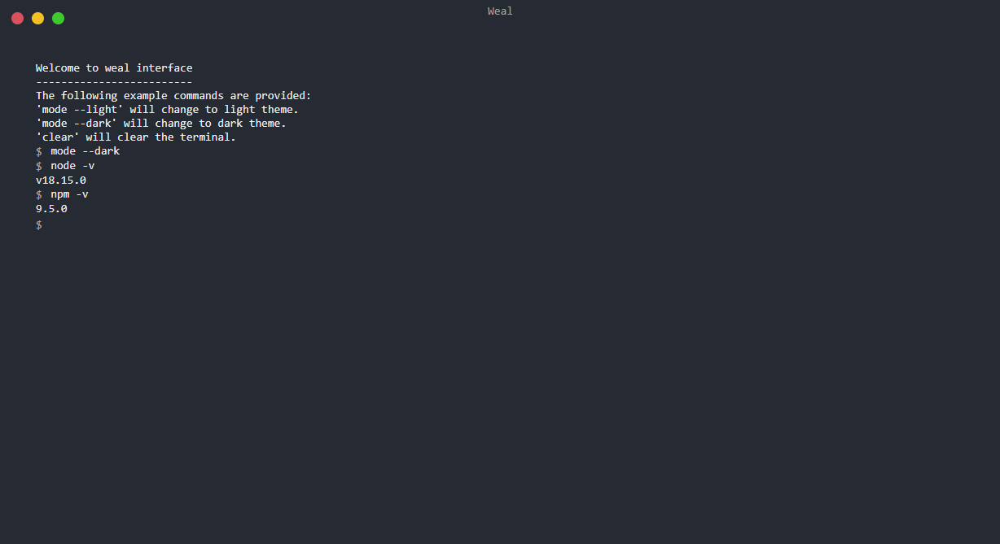

# Weal


Web interface for terminal



## Install

```bash
# recommended
npx weal

# using npm global installation
npm install -g weal

# using yarn global installation
yarn add global weal
```

## Command-line Interface (CLI)

Now, you can open any directory via the command **open**

```bash
weal open
```

The following is the help text from the weal cli. To see this and more information anytime,add the **help** command to your call.

```bash
weal help
```

Check version of weal with **version** command

```bash
weal version
```

## Tips

On windows before installing it globally you need to set your config prefix to avoid error when opening directory

```bash
npm config set prefix c:/Users/{userName}/AppData/Roaming/npm
```

## Support

Weal is an MIT-licensed open source project. It can grow thanks to the sponsors and support by the amazing backers.

## License

Weal is [MIT licensed](LICENSE).
